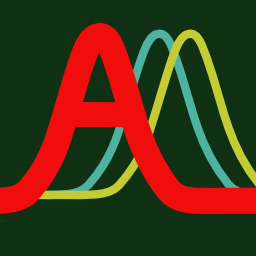
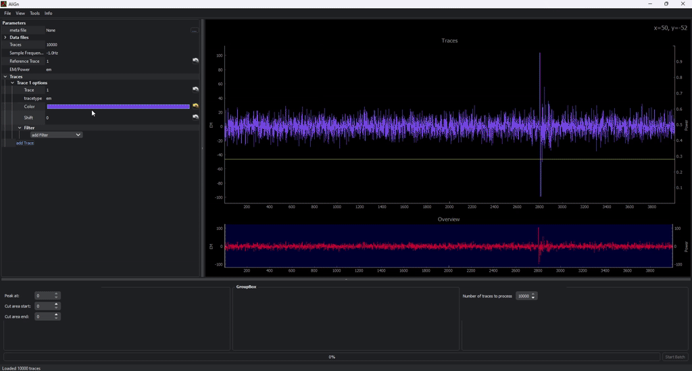

<h1> AliGn</h1>
 
<b>Visual tool to explore, align and process measurement data</b>

With AliGn, measurement data can be visualized, aligned and cropped. The main purpose of this tool is to prepare measurement data for further post-processing. This usually requires well-aligned data in which the signal to be examined (or the starting point of the signal) must lie exactly on top of each other over several traces. The input for AliGn is data that consists of several measurement series and is to be aligned with each other. Various filters are available for this purpose which enable the detection of distinctive points for the alignment of the signal. The aligned and trimmed data can be exported in the original data format.



## Installation
Download newest relase [here](https://github.com/BSI-Bund/AliGn/releases), run ```pip install <align-x.y.z-py3-none-any.whl>```. Start by running ```align``` (Script that was installed by pip. Maybe you have to add the path of the script pip has installed to the systems PATH).

Requires Python 3.9 or newer.

### Running in Virtual Environment
Due to the many dependencies, it is recommended to use a virtual environment:
```
pip install virtualenv
python -m venv align_venv
source align_venv/bin/activate (Linux) or
align_venv\Scripts\activate.bat (Windows)
pip install <align-x.y.z-py3-none-any.whl>
align
```


## Usage

Use this [Quick Tutorial](demo/howto.md) to generate a test data set and get an idea on how to use AliGn.

### Filter
Filters can be selected from the drop-down menu and are then displayed in the list of active filters and can then be parameterized. A filter can be removed again by right-clicking on the filter name. 
Filters are only temporarily applied to the signal. This means that the signal is not saved with any changes when it is exported. The filters are only used to find suitable peaks, thresholds, etc. in order to be reliably recognized by triggers. 
It's possible to add multiple filters. If more then one filter are active the filters will be processed in the order as the were added.

### Trigger
Like filters, triggers can also be selected from the drop-down menu and are then displayed in the list of active triggers and can then be parameterized. A trigger can be removed again by right-clicking on the trigger name. 
When a trigger is set and proper parameterized, a trigger point shall be shown in signal. Most trigger return one trigger point. Some return two trigger points. If a trigger was found a range around the trigger point(s) can be defined which shall be cut out and saved when the "batch processing" export is started.
It's possible to add multiple triggers. If more then one filter are active the triggers will be processed in the order as the were added.

### Data Formats
Two data formats are currently supported. 
 * Numpy arrays in npy format are supported. These should consist of a 1- or 2-dimensional array, with each row containing the measurement data of a trace.
 * The second data format is a proprietary format ("D15 Trace Data Metafile") which is used for our own measurements. The measurement data is available here as raw data in individual files, which are referenced in a meta file and which also contains information on the data type, number of traces, scope settings, comments and other meta information on the measurement. 

For our use cases, we often record several pieces of data in parallel during measurements. The “D15 format” therefore contains placeholders for EM, power, plain, cipher and auxiliary data. The metafile combines this data. With numpy arrays, there is no metafile that enables these data to be connected. Therefore, when importing numpy arrays, a separate npy file must be specified for each of the above-mentioned data fields.

### Custom Data Formats
Align uses an internal abstraction layer for display and filter processing, which makes it possible to use a standardized interface for both data formats. This makes it possible to use other, previously unsupported data formats in AliGn relatively quickly. To do this, the methods in the abstract class “AlignTraceData” (in align_trace_data.py) must be implemented for the new data format. 


## Build and Package Process
We use [Poetry](https://python-poetry.org/) for dependency management and package build process. If you want to build your own packages or if you need to install additional python packages for AliGn please install Poetry as described in the [documentation](https://python-poetry.org/docs/).
Once Poetry is installed you can build your own package by just call
```
poetry build
```
The python wheel (.whl file) can be found in the ./dist folder.