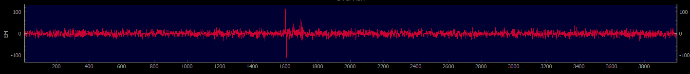
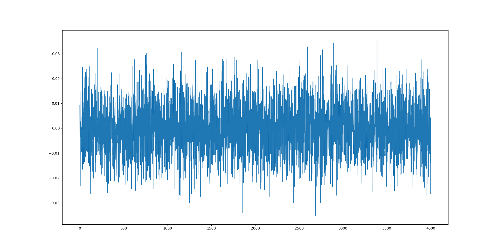
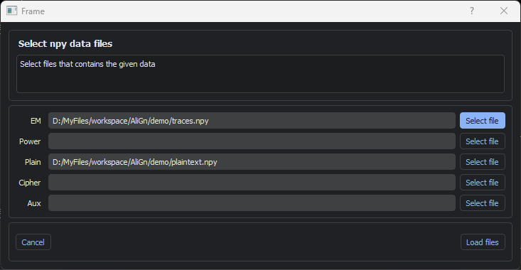
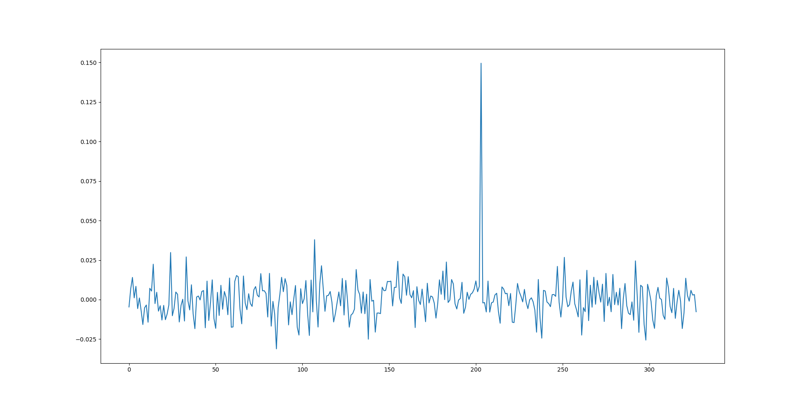

# Quick Tutorial on AliGn

## Test Data

The script `generate_traces.py` generates a small demo dataset. First,
execute

````
python generate_traces.py
````

Three files will be generated:

* `traces.npy`, a numpy array of shape `(10000,4000)`, i.e. 10000 traces with 4000 datapoints each
* `plaintext.npy`, a numpy array of shape `(10000, 16)`, i.e. 16 byte plain text values for each trace
* `key.npy`, a numpy array of shape `(16)`, i.e. a static 16 byte key

A trace looks similar to this:



It contains of mostly noise. Then there is a small with a small leakage of 
of `plaintext[i][j] XOR key[j]` for each `j` from `0...15` . 
Moreover, the overall signal has a much larger variance at this point.

The leakage part heavily jitters among the traces:

todo: include two traces above below, mark with red squares noise, leakage, variance

## Correlation Attack

As an attacker, if we obtain the traces and the plaintext value, we can easily obtain the
key with a correlation attack. We investigate each datapoint of trace in the following manner:

* for a datapoint `j`, we consider the vector `traces[:, j]`
* we guess a candidate key byte `k` in the range 0...255
* we compute the vector `x = plaintext[:, j XOR [ k, ... , k]`
* we compute the correlation between `x` and `traces[:, j]`

If we have computed enough traces and there is enough leakage, the correlation
for the correct key guess `k` should be significantly higher than for 
all other candidates values for `k`. Unfortunately, if we apply
the attack on the unaligned data and plot the correlation nothing 
stands out:



## Aligning the Traces via Rising Edge Trigger

We first open the `.npy` files. We interpret these traces as 
EM (electromagnetic emission) files.



Next, click on `add new filter`, and select a `rising edge` trigger.
We set the threshold to 40. Testing with various traces indicates, that we
always trigger the "suspicious" peak, where the signal leaks.

Now right click on `filters` and select `Set filters for batch processing`. Click on 
the button `Start Batch`, and each trace is processed. If the trigger
does not match, the corresponding trace is thrown away. Plaintexts are adjusted
accordingly. You will end up with a new folder `XXXX_YY_ZZ` containing the files 

* `em_aligned.npy` The processed trace data
* `plain_aligned.npy` The adjusted plaintext data

Now call the attack script and provide the new folder as a parameter

````python correlation_attack.py XXXX_YY_ZZ````

which will yield a clear correlation peak for the correct key value

